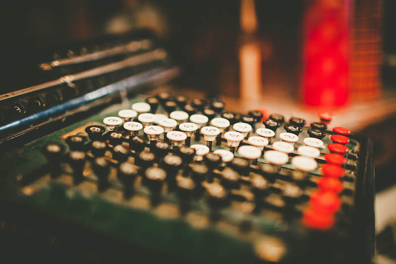
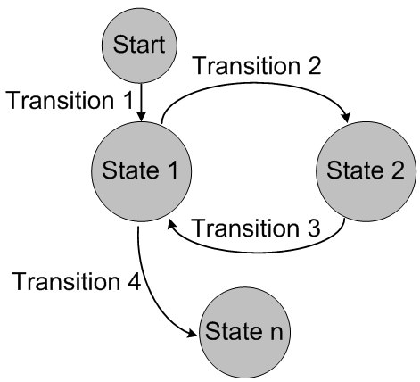
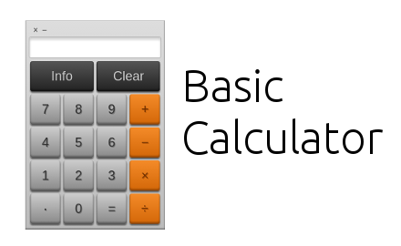

*In my first post, I decided to look back at my programming beginnings. More than an year ago, I write a post where I described the implementation of the calculator using mainly vanilla JavaScript. Although this code might look a little archaic today, I think it's good for a front-end developer to get back to the vanilla JavaScript once in a while without all those React and Angular abstractions. Enjoy!*

When I was implementing Free Code Camp's JavaScript Calculator challenge, I spent a good amount of time on it because I did it twice. When I made the first version of my calculator, I haven’t thought about it too much before I implement it. Although it had all the basic functionality, you can also type basically any number or operator whenever you wanted (e.g. 1….5 +++ 8 =+-). However,if you take a real calculator, you will find out that it lets you use only certain numbers or operators at the certain situations. So I tried to address all these issues in the first version of my calculator but it was kind of overwhelming. Therefore, it seemed to me that it will be easier if I start all over again.

I knew that I need to think more about the implementation of my JS calculator before I start to code. I need to think through every possible scenario since in each phase of the arithmetical operation, you want your calculator to react only when particular keys are pressed. So **I just did what you should do every time before you start to code a new project.**

What really helped me back then was that a friend of mine gave me a tip to try built the calculator using a *[finite state machine](https://en.wikipedia.org/wiki/Finite-state_machine) (FSM)*. FSM is *“[a state machine is any device that stores the status of something at a given time and can operate on input to change the status and/or cause an action or output to take place for any given change.](http://whatis.techtarget.com/definition/finite-state-machine)”*

Here's an illustration of how FSM works:


I hope that this post will help you to build a fully functional calculator in a way you’re maybe not familiar with. Also I hope it will be useful to anyone who wants to build a calculator using JavaScript but struggle with it or don’t know where to start.First, I was like *“No way, that sounds too difficult and it seems to me that it must be some abstract programming concept which would be hard to learn.”* However, after a couple of days, I changed my mind and I started to implement the calculator using a FSM.

First part of the post will be a little theoretical because we need first to think about how the FSM works and how it is going to help us to build up our calculator.

Are you ready? Let’s code!

### Step 1 – HTML and CSS
Before you can implement the calculator’s functionality, you need to design your calculator using HTML and CSS. Since we are making a basic version of the calculator, it should have at least these keys (of course you don't need the "info" key):



Designing your calculator is a very simple task, so I am not going to write about that.

When you have a visual version of your calculator, you need to (if you haven’t done so already) think about its functionalities. When implementing the calculator using the FSM pattern, it is very useful to draw a graph of your machine first, otherwise you can get easily lost during its implementation. But before we make this graph, **we need to define the states of the calculator and the variables that we are going to use to store the numbers and operators.**

### Step 2 – Define states
If you think about calculator’s functionality (enter a number, press operator, enter a second number, press equal sign), it is obvious that it will have at least 5 basic states. You can also figure out what keys must be pressed in order to get into a certain state.

However, you need to take into an account the "point" key as well. For example, if you press this key on the real calculator as a first character, your number will start with "0.". So, in the end we need to define 3 more states, that is 8 states in total.

States (you can call these states whatever you want) - the calculator transitions into a particular state when:

1. START – state of the calculator - default

2. FIRST_ARG – (as a first number) - a number key is pressed

3. FIRST_ARG__FLOAT - as a part of the first argument (number) - a point key is pressed

4. OP – any (except equal sign) - operator key is pressed

5. SECOND_ARG - (as a second number) - a number key is pressed

6. SEC_ARG__FLOAT - when a second number contains a point - not at its beginning

7. SEC_ARG__DOT - when a second number (0.) - begins with point

8. EQUALS – when an - equal sign is pressed

It is convenient and it will make your code more readable, if you store these states as the properties in an object. Each property will represent a state of your calculator. **The idea is that when you refresh a page, your calculator will be in a default state and by clicking on different keys, the state is going to change.** This process will go on and on, until you press a clear button on your calculator or when you refresh the page itself.

### Step 3 – Define variables
Now, you will need to define the variables. These variables are going to change a lot since they will store everything you type into your calculator. Try to keep the number of the variables as low as possible, otherwise your code might become unnecessary complicated.

Five variables should be enough:

- var state - monitors current state of the calculator
- var disp – stores the number and monitors what is currently displayed on the calculator’s display
- var acc1 - stores the first number for further operations
- var acc2 - stores the second number for further operations
- var op - monitors current arithmetical operator

In our code, these variable will be also stored in the object.

### Step 4 - Graph
At this point, you have everything you need (the basic states of the calculator, which keys needs to be pressed in order to transition between these states, variables which are going to store user’s input). So, it is the right time for you to draw a graph which will put this information into the context and help you to visualize the functionality of your calculator.

When drawing this graph, you need to keep in mind that you can press only certain types of keys during the particular state of the calculator. For example, a real calculator won’t let you to type five points in a row or twenty operators in a row. From every state, you can only go to the limited number of other states.

There are many ways how to draw a FSM graph and Google will help you with that. Your basic graph should look like this:


Although this graph looks a bit complicated, it's actually pretty straightforward. I've already mentioned many things you can see there. There are variables (top of the picture) as well as individual states (in the rectangles).

From each state, you can see arrows pointing to other possible states. Above each arrow is a text, separated by a slash, explaining what caused the transition into the next state and how it affects the variables.

The words **before the slash** refer to the calculator’s key that is clicked:

- num – number key
- op_key – operator key (except equal sign)
- equal – equal sign key
- point – point key

The words **following the slash** refer to the variables affected by the pressed key. For example, if you are in the START state of the calculator and you press a number key, you will get to the FIRST_ARG state and *disp* variable will get a new value, the same as the number of the pressed key (num/disp = num). If you press a number key again, its number value will be added to the *disp* variable next to the previous number (num/disp += num). However, if you press an operator key instead, variable *op* will be equal to that operator (op_key/op = op_key) and *disp* variable won’t get a new character. Instead, the *acc1* variable will be equal to *disp* (acc1 = disp) because we want *disp* to be able to store and display a following number which will be probably pressed after the operator key.

This behavior is basically the same for the transitions between all the other calculator's states.

See? It isn’t that difficult, is it?

Only thing we need to do is to **transform this graph into a code!** 

### Step 5 - Code setup
Let’s start with the definition of the object *kclass* that will store all the calculator’s keys that can be possibly pressed. This will help us later to recognize which key was pressed. As you can see, these are simply the keys which can be found on any calculator.

```js
//object containing key categories that can be clicked
var kclass = {
  //number
  NUM: 1,
  //dot
  DOT: 2,
  //operator
  OP: 3,
  //clear entry
  CE: 4,
  //equal
  EQ: 5
}
```

The only key that is missing is AC (all clear) key, which resets the calculator’s memory. We will talk about this key later on. On the other hand, the CE (clear entry) key which resets only the currently displayed input is present.

Now, we are going to define an object with all the calculator's states.

```js
//object containing states
var states = {
  //default state
  START: 1,
  //when the first number is added
  FIRST_ARG: 2,
  //when the first number begins with a dot (0.) or when it has a dot anywhere else
  FIRST_ARG_FLOAT: 3,
  //when the operator is added
  OP: 4,
  //when the second number is added
  SECOND_ARG: 5,
  //when the second number has a dot not at its beginning
  SEC_ARG_FLOAT: 6,
  //when the second number begins with dot(0.)
  SEC_ARG_DOT: 7,
  //when we get the result of the arithmetic operation
  EQ: 8
}
```

Next, let’s create an object *calc* that will contain all the functionality related to our calculator. I am going to separate this complex object into the smaller code snippets for the clarity's sake.

Let’s start with the variables declaration. Note that the state variable is set to the START state and other variables are empty. This is the default state of the calculator.

```js
var calc = {
  //monitors current state
  state: states.START,
  //monitors current operator
  op: "",
  //monitors what is currently displayed on the display
  disp: "",
  //stores the first number for further operations
  acc1: "",
  //stores the second number for further operations
  acc2: "",
```

Keep in mind, that you need to give classes and ids to the elements in your HTML document because you will need to select them using the JavaScript.

Our code presupposes these classes and ids on your calculator's elements:

- display of the calculator (id=“display”)
- all number keys (class=“digit”)
- all operators (except equal sign) keys (class=”op_key”)
- point key (class=”point”)
- equal sign key (class= “equals”)
- AC key (class=“allClear”)
- CE key (class=“clearEntry”)

### Step 6 - Implementation
Keep in mind, that we are still talking about the contest of the *calc* object. The main functionality that controls transitions between the states will is stored in the function *doStep*. This function represents the implementation of the FSM. It takes two arguments: a category of the pressed key (defined in the object *kclass*) and the particular value of the clicked HTML element (number or operator). Inside this function, we use a *switch* statement for the transition between the individual states of the calculator. Each switch case represents a particular state. At the end of every switch case, state of the calculator gets updated.

Since the *state* variable is set to the default **START** state at the beginning, this state will be our starting state.

```js
//function that controls transitions between states using switch
//two arguments - key_class(key category), key(specific key)
doStep: function(key_class, key){
    switch (this.state){
        case states.START:
        if(key_class === kclass.NUM){
            //state action
            this.dispSet(key);
            //move to the next state
            this.state = states.FIRST_ARG;
        }
        if(key_class === kclass.DOT){
            this.dispSet("0.");
            this.state = states.FIRST_ARG_FLOAT;
        }
        break;
```

Each switch case describes what choices can be made in a particular state of the calculator. You can see that the only two things we can do in the START state is to press a number or a point key. By pressing the number key, the first character will be a number. If you decide to press the point key first, the first character will be “0.” instead. Function *dispSet* updates the *disp* variable with a value that is passed as its argument. In this case it is the value of the pressed HTML element (key) or “0.”. After that, *displayUpdate* function is called and (surprisingly) the calculator's display is updated.

```js
case states.FIRST_ARG:
    if(key_class === kclass.NUM){
        this.dispAppend(key);
        this.state = states.FIRST_ARG;
    }
    if(key_class === kclass.OP){
        this.op = key;
        //store value of the disp in a acc1 variable in order to be able to store second number in the disp
        this.acc1 = this.disp;
        this.state = states.OP;
    }
    if(key_class === kclass.DOT){
        this.dispAppend(key);
        this.state = states.FIRST_ARG_FLOAT;
    }
    if(key_class === kclass.CE){
        this.dispSet("0");
        calc.state = states.START
    }
    break;
```

The second state is called **FIRST_ARG**. You can see that it works just as the first state. The only difference is that there are more choices that can be made. In other words, you can press a range of buttons which will affect the arithmetical operation differently. Function *dispAppend* differs from the function *dispSet* in a way that it concatenates two strings together rather than set a brand new value of the variable.

```js
case states.FIRST_ARG_FLOAT:
    if(key_class === kclass.NUM){
        this.dispAppend(key);
        this.state = states.FIRST_ARG_FLOAT;
    }
    if(key_class === kclass.OP){
        this.op = key;
        //store value of the disp in a acc1 variable in order to be able to store second number in the disp
        this.acc1 = this.disp;
        this.state = states.OP;
    }
    if(key_class === kclass.CE){
        this.dispSet("0");
        calc.state = states.START;
    }
    break;
case states.OP:
    if(key_class === kclass.NUM){
        this.dispSet(key);
        this.state = states.SECOND_ARG;
    }
    if(key_class === kclass.DOT){
        this.dispSet("0.");
        this.state = states.SEC_ARG_DOT;
    }
    break;
case states.SECOND_ARG:
    if(key_class === kclass.DOT){
        this.dispAppend(key);
        this.state = states.SEC_ARG_FLOAT;
    }
    if(key_class === kclass.NUM){
        this.dispAppend(key);
        this.state = states.SECOND_ARG;
    }
    if(key_class === kclass.EQ){
        //store the second number in the acc2 variable so that we can use it if the equal sign is pressed more than once
        this.acc2 = this.disp;
        //calculate the result
        this.operation(this.acc1, this.disp);
        this.displayUpdate(this.disp);
        this.state = states.EQ;
        }
    if(key_class === kclass.OP){
        //calculate the result
        this.operation(this.acc1, this.disp);
        this.op = key;
        //store the result of the operation in the acc1 in order to be used in the next operation
        this.acc1 = this.disp;
        this.displayUpdate(this.disp);
        this.state = states.OP;
    }
    if(key_class === kclass.CE){
        this.dispSet("0");
        calc.state = states.OP;
    }
    break;
```

The important step we can make in the **SECOND_ARG** state is pressing the equal sign (EQ). If we do this, the *disp* variable is firstly stored in the *acc2* variable because we need to remember this value for the scenario that we wanted to press the equal sign again. Secondly, the function *operation* takes two numbers as arguments and performs a particular calculation with them. The type of the calculation is determined by the value of the *op* variable, which was set earlier when the operator key was pressed.

```js
    case states.SEC_ARG_FLOAT:
        if(key_class === kclass.NUM){
            this.dispAppend(key);
            this.state = states.SEC_ARG_FLOAT;
        }
        if(key_class === kclass.EQ){
            this.acc2 = this.disp;
            this.operation(this.acc1, this.disp);
            this.displayUpdate(this.disp);
            this.state = states.EQ;
            }
            if(key_class === kclass.OP){
                this.operation(this.acc1, this.disp);
                this.op = key;
                this.acc1 = this.disp;
                this.displayUpdate(this.disp);
                this.state = states.OP;
            }
            if(key_class === kclass.CE){
                this.dispSet("0");
                calc.state = states.OP;
            }
        break;
    case states.SEC_ARG_DOT:
        if(key_class === kclass.NUM){
            this.dispAppend(key);
            this.state = states.SEC_ARG_FLOAT;
        }
        if(key_class === kclass.CE){
            this.dispSet("0");
            calc.state = states.OP;
        }
        break;
    case states.EQ:
        if(key_class === kclass.EQ){
            this.operation(this.disp, this.acc2);
            this.displayUpdate(this.disp);
            this.state = states.EQ;
        }
        if(key_class === kclass.NUM){
            this.dispSet(key);
            this.state = states.FIRST_ARG;
        }
        if(key_class === kclass.OP){
            this.op = key;
            this.acc1 = this.disp;
            this.state = states.OP;
        }
        if(key_class === kclass.DOT){
            this.dispSet("0.");
            this.state = states.FIRST_ARG_FLOAT;
        }
        if(key_class === kclass.CE){
            this.dispSet("0");
            this.clearer();
        }
        break;
    }
},
```

So, we are finally at the end of the *doStep* function. You can see that the logic that controls the transitioning between the states is pretty straightforward. It just repeats itself again and again for every state. **This is the power of the FSM pattern.**

The following part of our *calc* object is composed of methods about which we've already talked about. The only method, I haven’t mentioned is the *clearer* method which is used when the AC (all clear) key is pressed. It simply resets the calculator's memory.

```js
  //does all the arithmetical operations
  operation: function(first, sec){
      if(this.op === "Ă·"){
          this.disp = first / sec;
      }
      if(this.op === "-"){
          this.disp = first - sec;
      }
      if(this.op === "x"){
          this.disp = first * sec;
      }
      if(this.op === "+"){
          this.disp = Number(first) + Number(sec);
      }
      if(this.op === "%"){
          this.disp = first % sec;
      }
  },
  //restarts the calculator to the default state
  clearer: function(){
      $("#display").text(0);
      this.state = states.START;
      this.op;
      this.disp;
      this.acc1;
      this.acc2;
  },
  //appends a display var
  dispAppend: function(key){
      this.disp += key;
      this.displayUpdate(this.disp);
  },
  //set a new value to the display var
  dispSet: function(key){
      this.disp = key;
      this.displayUpdate(this.disp);
  },
  //dipsplay display var
  displayUpdate: function(dispText){
      $("#display").text(dispText);
  }
}
```

Finally, to finish our project, the last thing we need to do is to set the click listeners for the calculator’s keys and then define what will happen when a particular key is pressed. Most of the time we are just calling the *doStep* function with different arguments.

```js
//when the number is clicked
$(".digit").on("click", function(){
  calc.doStep(kclass.NUM, $(this).html());
})

//when the operator is clicked
$(".op_key").on("click", function(){
  calc.doStep(kclass.OP, $(this).html());
})

//when the equal sign is clicked
$(".equals").on("click", function(){
  calc.doStep(kclass.EQ, $(this).html());
})

//when the dot is clicked
$(".point").on("click", function(){
  calc.doStep(kclass.DOT, $(this).html());
})

//when AC clicked - clear all variable values
$(".allClear").on("click", function(){
  calc.clearer();
})

//when CE clicked - erase the last entered input
$(".clearEntry").on("click", function(){
  calc.doStep(kclass.CE, $(this).html());
})

//default state of calculator
  $("#display").text(0);
```

### Conclusion
The most challenging part in the process of the calculator's implementation using the FSM pattern was the creation of the graph which we used as a blueprint for our actual code. In the graph, we needed to address every possible behavior of the calculator. Once it was finished, the implementation of the calculator itself was much easier.

You can check my JS calculator's full code on my *[github](https://github.com/codinglawyer/JavaScript-Calculator)*.

I hope that my description will help you to build your own calculator using JavaScript. Maybe you will create the same one or maybe you will get inspired and you choose a different path.