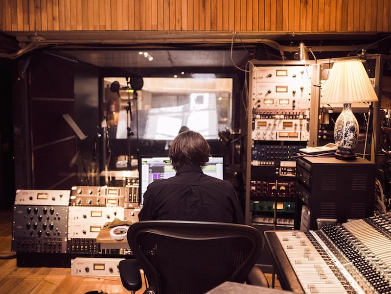

*Originally, I published this post more than [half  a year ago](https://ideas.ataccama.com/i-stopped-being-a-lawyer-became-a-developer-and-its-awesome-5311e8d74882?gi=af6efc52acc8). After a couple of months in my first programming job, I decided to describe my journey from a lawyer to a developer and mention the resources that helped me to achieve my programming dream. I’m sure that this post will be helpful to anyone who wants to become a developer and inspiring to those who already began their exciting journeys. Enjoy!*

### Are you satisfied with your current job?

Does your career fulfill you and move you in the right direction? Have you ever sat down to really think about it? For too long, I went with the flow and took whatever reasonable professional options came up, not giving them any thought. Or at least not enough.

That changed a year ago when I decided I wasn’t satisfied with my law career and needed a change. I wish I had come to that conclusion sooner, but the important thing is that this realization motivated me to pursue a more fulfilling career path.

Take some time to really think about your future, too. If you’re not satisfied with your current job, now is the time to do something about it.

I hope my experience will convince you that it’s never too late to make a change. Read on to learn how I transformed from lawyer to programmer, and discover resources that helped me along the way.

### My coding journey

#### I need a change

I dedicated years of my life to law. I enjoyed my studies, graduated, and got my first job. I always thought I’d make a successful lawyer, but after a few years in the field, I had doubts about the direction of my career.

On the other hand, I didn’t want to waste time switching to a field where I had no experience.

In the end, I decided that five years wasn’t very long compared to the prospect of working an unsatisfying job for decades.

With this in mind, I decided to look into other fields where I could learn, do work I’d enjoy, and not hate Monday mornings.

#### Which way to go?
I’d had positive experiences with online courses in the past, and started my search there. Initially, I came across a *[course](https://www.edx.org/course/science-cooking-haute-cuisine-soft-harvardx-spu27x-0)* that combined science and cooking. I love to cook and definitely enjoyed it, but still felt that cooking was more of a hobby than profession for me.

The course helped me realize that although I never studied science, I understood formulas and calculations when applied to something I enjoyed. This meant that I didn’t have to limit my future to the social sciences.

I returned to online courses, and found an IT section with so much to choose from: machine learning, networking, programming, and more. Since I’d already taken a basic HTML and CSS course in primary school, I settled on web development. Web development seemed more beginner-friendly than other courses, since I could actually see the results of my work.

My programming journey started with *[The Web Developer Bootcamp](https://www.udemy.com/the-web-developer-bootcamp/)*, thanks to which I acquired solid foundations in HTML, CSS and JavaScript.

#### Develop it!

While learning front-end foundations, I discovered another important element of coding: developing web applications from scratch. It’s relatively easy to code with guidance from an experienced programmer, but starting with empty files is a completely different matter.

For that I joined the *[Free Code Camp](https://www.freecodecamp.org/)* (FCC), an open source community that helps you learn to code through self-paced exercises. I spent a significant amount of time on the FCC’s application development assignments.

To become a good developer who creates fully-functioning applications, you need a solid knowledge of basic programming principles plus the ability to apply these principles in practice.

The Web Developer Bootcamp and Free Code Camp provided me with exactly this — a theoretical background + practical exercises, together forming a solid foundation for my web developer journey.

From then on, I developed applications from scratch using technologies learned along the way. In my view, this is the best way to understand and master a particular technology.

### Getting advanced

Although I was able to develop my own applications, they were built in *[vanilla (generic) JavaScript](https://snipcart.com/blog/learn-vanilla-javascript-before-using-js-frameworks)* or a basic framework (jQuery). I was still at the beginning of my programming journey, and I clearly needed to broaden my JavaScript knowledge to keep moving forward.

My gateway to this realm was *[JavaScript: Understanding the Weird Parts](https://www.udemy.com/understand-javascript/)*. There, I learned what happens under the hood. The course helped me uncover advanced concepts such as prototypal inheritance, functional programming, and scope chains. I also read Kyle Simpson’s *[You Don’t Know JavaScript](https://github.com/getify/You-Dont-Know-JS)* book series. It taught me everything from closures and prototypes to asynchronicity, the backbone of JavaScript development.

Thanks to these resources (really, thanks so much!), I was able to understand more sophisticated technologies such as a React library.

#### Let’s React

With these advanced concepts in mind, I delved into React, a simple component library that enabled me to develop complex applications. As a bonus, I later found out that many employers require it.

*[Modern React with Redux](https://www.udemy.com/react-redux/)* helped me understand React and taught me how to develop fully functional applications using modern syntax (ES6).Then, with the help of React and Redux official documentation, I started developing React applications on my own.

### Ready? I think so.

These resources helped me reach the point where I was ready to apply for a front-end developer position, but the right resources can only take you so far. My motivation pushed me to where I wanted to be. I set myself a goal and pursued it.

*“Do. Or do not. There is no try.”*    
(Yoda, The Empire Strikes Back)

**One year later, I’m writing this article from my desk as a front-end developer— a job that truly satisfies me.**

### Postscript

You might be wondering what I like about being a programmer. The *thing* for me is creating something that actually works and may even be useful to people.

A defining feature of law is that there are conflicting opinions about any particular case. Usually, we cannot determine which is correct before the judge makes a decision. In comparison, a programmer’s choice is often binary. This means that you can always test if your code works or not — and if it doesn’t, it’s a user error… right? :)