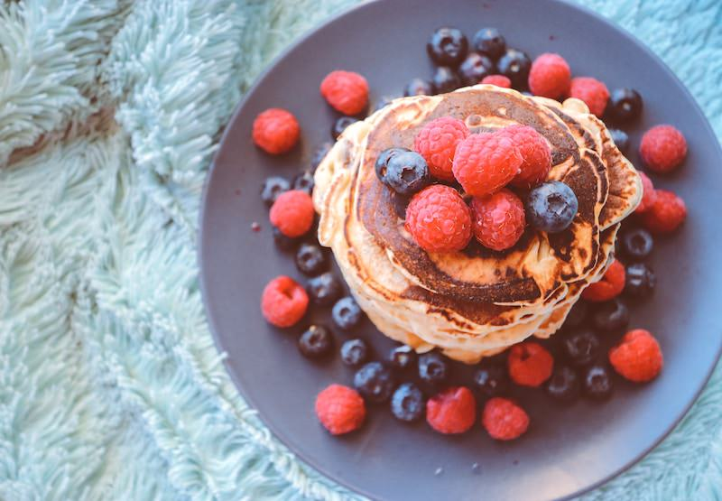
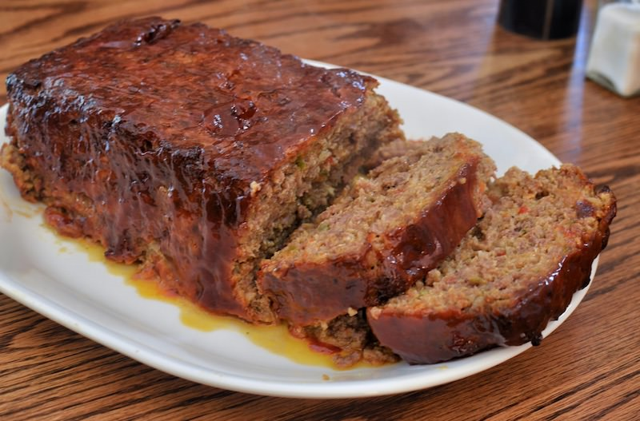
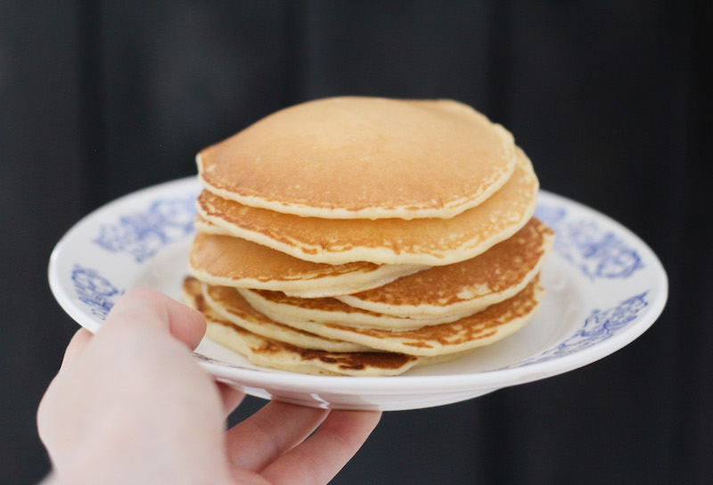

*[In the previous post](https://www.codinglawyer.io/posts/introducing-higher-order-components)*, you’ve learned how higher-order components (HoCs) work under the hood and how to define one yourself. Now, we’ll take it a little bit easier. We'll use pancakes metaphor to help you to illustrate the principles of the higher-order component in a more engaging way.

Let's start with an example.

```Javascript
    class FilteredList extends React.Component {
       constructor(props) {
          super(props)
          this.state = { value: this.props.defaultState }
       }
       updateState(value) {
          this.setState({ value })
       }
       render() {
          const otherSide = this.state.value === 'dark' ? 'light' : 'dark'
          const transformedProps = this.props.list.filter(char => char.side === this.state.value)
          return (
             <div>
                <button onClick={() => this.updateState(otherSide)}>Switch</button>
                {transformedProps.map(char =>
                   <div key={char.name}>
                      <div>Character: {char.name}</div>
                      <div>Side: {char.side}</div>
                   </div>
                )}
             </div>
          )
       }
    }
    
    ReactDOM.render (
       <FilteredList defaultState='dark' list={starWarsChars} />,
       document.getElementById('app')
    )
```

`FilteredList` is a huge component that does so many things. It maintains the state and filters the list of the Star Wars characters according to their side. Moreover, it renders the character list with a button to the screen. It takes care of all the logic and presentation, and because of that, it’s hardly ever reusable.

You can think of this component as **meatloaf**.



When preparing meatloaf, you take the meat, breadcrumbs, garlic, onion, and eggs, mix them together, put the raw meatloaf into the oven, and wait until it’s cooked. There’s no way that you can take the eggs or the onion from the meatloaf, since everything is irrevocably combined together. This is the same as a component that is a mixture of logic and UI. You just can’t take something from it. You need to use it as is or not at all.

Try to think of the presentational components as **pancakes**.



However, simple pancakes without any decoration are pretty boring, and no one eats them like this anyway. So you want to decorate them. You can pour maple syrup on them or put some berries or chocolate on top of them. So many possible decorating layers for you to use!


In the React application, these decorating layers are represented by the HoCs. So, just as you decorate a pancake according to your taste, you also decorate the presentational component using HoC with the functionality you want. As a result, you can reuse a particular presentational component in different places of your application and decorate it with the HoC you want for a particular case.

However, you can’t do that with the component that is responsible for all the logic and presentation, since everything is irrevocably combined together.

I hope that this metaphor gave you a better understanding of the HoC pattern. If not, at least I made you hungry :).