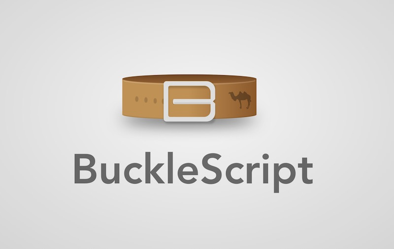
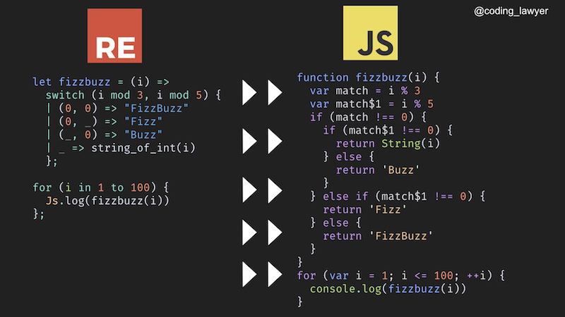

Why should you give ReasonML a try? It's a functional programming language that provides you with strong type system, powerful JavaScript interop and many other built-in features that will improve your developer experience. Let's talk about these features a little bit more.

## BuckleScript

One of Reason’s powerful features is *[BuckleScript compiler](https://bucklescript.github.io/)*, which takes your Reason code and compiles it to readable, and performant JavaScript with great dead code elimination. You’ll appreciate the readability if you’re working on a team where not everyone is familiar with Reason, since they’ll still be able to read the compiled JavaScript code.

The similarity with JavaScript is so close that some of Reason’s code doesn’t need to be changed by the compiler at all. So, you can enjoy the benefits of the statically typed language with no change to the code whatsoever.

    let add = (a, b) => a + b;
    add(6, 9);

This is valid code in both Reason and JavaScript.

BuckleScript is shipped with four libraries: the standard library called *[Belt](https://bucklescript.github.io/bucklescript/api/Belt.html)* (*[OCaml standard library is insufficient](https://discuss.ocaml.org/t/what-is-the-preferable-solution-for-the-role-of-standard-library/1092)*), and bindings to JavaScript, NodeJS and, DOM APIs.

Since BuckleScript is based on OCaml compiler, you’ll get *[a blazingly fast compilation](https://bucklescript.github.io/docs/en/build-performance)* that is much faster than Babel and several times faster than TypeScript.

Let’s compile our FizzBuzz algorithm written in Reason to JavaScript.

As you can see, the resulting JavaScript code is pretty readable. It seems like it was written by a JavaScript developer.

Not only does Reason compile to JavaScript, but to native and bytecode as well. So, you can write a single application using Reason syntax and be able to run it in the browser on MacOS, Android, and iOS phones. There’s a game called *[Gravitron](https://github.com/jaredly/gravitron)* by Jared Forsyth which is written in Reason and it can be run on all the platforms I’ve just mentioned.

## JavaScript interop

BuckleScript also provides us with Javascript *[interoperability](https://en.wikipedia.org/wiki/Interoperability)*. Not only can you paste your working JavaScript code in your Reason codebase, but your Reason code can also interact with that JavaScript one. This means you can easily integrate Reason code into your existing JavaScript codebase. Moreover, you can use all the JavaScript packages from the NPM ecosystem in your Reason code. For example, you can combine Flow, TypeScript, and Reason together in a single project.

However, it’s not that simple. To use JavaScript libraries or code in Reason, you need to port it to Reason first via Reason bindings. In other words, you need types for your untyped JavaScript code to be able to take an advantage of Reason’ s strong type system.

Whenever you need to use a JavaScript library in your Reason code, check if the library was already ported to Reason by browsing the *[Redex](https://redex.github.io/)* database. It’s a website that aggregates different libraries and tools written in Reason and JavaScript libraries with Reason bindings. If you found your library there, you can just install it as a dependency and use it in your Reason application.

However, if you didn’t find your library, you’ll need to write Reason bindings yourself. If you’re just starting with Reason, keep in mind that writing bindings aren’t a thing you want to start with, since it’s one of the more challenging things in Reason’s ecosystem.

*Fortunately, I’m just writing a post about writing Reason bindings, so stay tuned!*

When you need some functionality from a JavaScript library, you don’t need to write the Reason bindings for a library as a whole. You can do that only for the functions or components you need to use.

## Functional programming

Although OCaml itself is a *[multi-paradigm language](https://en.wikipedia.org/wiki/OCaml)* — combining functional with object-oriented programming — Reason put more emphasis on its functional programming side.

So, you can think of Reason as a functional programming language with immutability as one of its core principles. So, you get all these features: the immutable data structures, functional iteration methods for them, currying, piping, first-class functions, etc.

On the other hand, Reason also provides us with escape hatches, so we can perform side-effects and mutate our data. However, these are just opt-outs, so you’ll write such mutations explicitly using imperative syntax.

If you were a JavaScript developer before Reason came out and wanted to learn a functional programming language, you’d have had to also learn a whole new syntax and set of rules. This might’ve discouraged many people. With Reason, you mainly need to understand functional programming principles.

Reason opens the entire functional programming realm to all interested JavaScript developers. It provides us with an opportunity to use all those cool OCaml features using syntax we dearly know.

## Type system

Reason is a statically typed language with a strong type system, which means it evaluates the types of your values during the compilation time. In other words, you don’t need to run your code to check if your types are correct.

Strong type system means clearer and safer code. Reason’s type system is superior to what you’d get from *[TypeScript](https://www.typescriptlang.org/)* or *[Flow](https://flow.org/)* (which is written in OCaml). In Flow, it’s quite easy to lie to your type system. As a result, you’ll often get only partial type coverage of your code.

You get reliable type safety from these libraries only if you’re very disciplined and if you understand the type system well. If you don’t have any experience with typed languages, a loose type system isn’t a good place to start learning how type system works.

Compared to these libraries, Reason’s type system requires less effort to maintain and you can rely on it 100% since it won’t allow you to write untyped code. As a result, you’ll get no runtime exceptions in production.

Having a type system doesn’t mean you need to explicitly define types for all your values. If you don’t want to write types manually, the compiler will figure out (infer) them for you. For example, if you’re using a value as an `integer`, the compiler will set the type to the `integer` automatically.

    let plus = (a, b) => a + b

    /* type inference by compiler */
    (int, int) => int

This enables you to write your code faster without losing benefits of static typing.

The advantages of types are most visible in the case of functions. If you know the types of your parameters, it’s much easier to understand what the function does.

It might seem that writing types mean more code and complexity. However, that’s not the whole story, since the static types will force you to think differently about structuring your code and to find ways to simplify it.

Moreover, static typing in Reason will give you awesome developer experience since your favorite editor will provide you with assistance. You’ll get code auto-completion, integrated documentation, and various hints. And when your code compiles, everything will happen really fast because of the Reason’s powerful build system.

If you’re a newcomer, learning static types will take you some time. However, Reason will help you with that since it won’t compile your code if your types are wrong and it’ll provide you with readable warning and error messages.

## Reason formatter

In JavaScript, we have *[Prettier](https://prettier.io/)* (inspired by Reason formatter) that provides us with many options for formatting our code. In Reason, you don’t have this flexibility. This decision was made by the creators of the language themselves. So, Reason’s formatter provides you with a standard way to format your code. As a result, every Reason code you’ll encounter will be formatted the same way.

You’ll get the formatter via your Reason code editor extension. How does it work? It takes your Reason code, parses it to the abstract syntax tree (AST) and rewrites it so it’s always consistent. Not only does it do code formatting for you, but it can also identify optimal constructs for your code. For example, if you pattern match for true or false, it’ll transform it to the ternary operator. Moreover, it’ll also help you to convert the old version of Reason syntax to the current one since it works on the AST level. If you want to learn more, check out this *[post by Cheng Lou](https://medium.com/@chenglou/cool-things-reason-formatter-does-9e1f79e25a82)*.