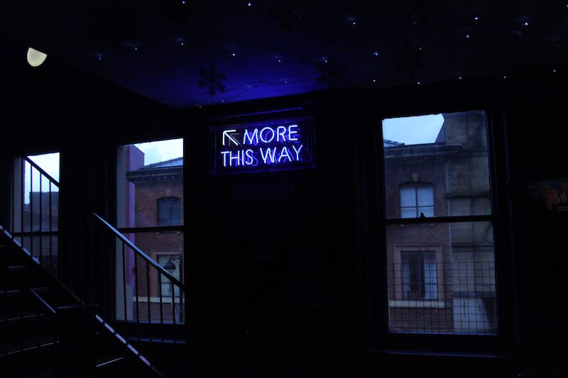

You may have heard of *[Reason](https://reasonml.github.io/)* before. It’s a syntax on top of *[OCaml](https://ocaml.org/)* that compiles to both readable JavaScript code and to native and bytecode as well.

This means you could potentially write *[a single application](https://github.com/jaredly/gravitron)* using Reason syntax, and be able to run it in the browser, and on Android and iOS phones as well.

This is one of the reasons why Reason (ouch, pun) is becoming increasingly popular. This is especially true in the JavaScript community because of the syntax similarities.

If you were a JavaScript developer before Reason came out and wanted to learn a functional programming (FP) language, you would have had to also learn a whole new syntax and set of rules. This might’ve discouraged many people.

With Reason, you mainly need to understand the FP principles on which it’s based — such as immutability, currying, composition, and higher-order-functions.

Before I discovered Reason, I was trying to use FP principles in JavaScript as much as I could. However, JavaScript is limited in this sense, since it’s not meant to be an FP language. To take advantage of these principles effectively, you need to use a bunch of libraries that create complicated abstractions which are hidden from you.

Reason, on the other hand, opens the entire FP realm to all interested JavaScript developers. It provides us with an opportunity to use all those cool OCaml features using syntax we dearly know.

Last but not least, we can write our *[React](https://reasonml.github.io/reason-react/)* or *[React Native](https://github.com/reasonml-community/bs-react-native)* apps using Reason.

## Why should you give Reason a try?

I hope you’ll discover the answer for yourself by the time you've finished reading this series of posts.

As we go through the source code of the classic Tic Tac Toe game — written in Reason, using React — I’ll explain the core features of the language. You’ll see the benefits of the strong type system, immutability, pattern matching, functional composition using pipe, and so on. Unlike JavaScript, these features are intrinsic to Reason itself.

## Warming up

Before getting your hands dirty, you need to install Reason on your machine following *[this guide](https://reasonml.github.io/docs/en/installation)*.

After that, you need to setup your app. To do this, you can either clone *[my repository](https://github.com/codinglawyer/reason-tic-tac-toe)* containing the code of our app or you can setup your own project using *[ReasonScripts](https://github.com/reasonml-community/reason-scripts)* and code along.

To view your app in the browser, you need to compile your Reason files to JavaScript ones first. The *[BuckleScript](https://bucklescript.github.io/)* compiler will take care of that.

In other words, when you run `npm start` (in the ReasonScripts project), your Reason code gets compiled to JavaScript. The result of the compilation is then rendered to the browser. You can see for yourself how readable the compiled code is by checking the `lib` folder inside your app.

## Our first component


As we’ve already mentioned, our Tic Tac Toe app is written using *[ReasonReact](https://github.com/reasonml/reason-react)* library. This makes Reason approachable for JavaScript developers, and a lot of newcomers are coming from this community.

Our app has a classic component structure, like any other React app. We’ll go through the components top-down when talking about UI, and bottom-up when describing their logic.

Let’s get started by taking a look at the top level `App` component.

```js
let component = ReasonReact.statelessComponent("App");
let make = _children => {
  ...component,
  render: _self =>
    <div>
        <div className="title">
          (ReasonReact.string("Tic Tac Toe"))
        </div>
        <Game />
    </div>,
};
```

The component gets created when you call `ReasonReact.statelessComponent` and pass the name of the component to it. You don’t need any class keywords like in React, since Reason doesn’t have any whatsoever.

The component is neither a class nor function — it’s a so-called *[record](https://reasonml.github.io/docs/en/record.html)*. `record` is one of Reason’s data structures, which is similar to the JavaScript object. Unlike the latter, however, `record` is immutable.

Our new `record` component contains various default properties such as the initial state, lifecycle methods, and render. To adjust the component to our needs, we need to override some of these properties. We can do that inside the `make` function that returns our component.

Since the `record` is immutable, we can’t override its properties by mutation. Instead, we need to return a new `record`. To do this, we need to spread our component and redefine the properties we want to change. This is very similar to the JavaScript object spread operator.

Since the `App` is a pretty simple component, we want to override only the default `render` method so we can render our elements to the screen. The `render` method takes a single `self` argument that gives us access to the state and reducers, as we’ll see later.

Since ReasonReact supports *[JSX](https://reactjs.org/docs/introducing-jsx.html)*, our `render` function can return JSX elements. The uncapitalized element will be recognized as a DOM element — `div`. The capitalized element will be recognized as a component — `Game`.

Due to Reason’s strong type system, you can’t simply pass a string to an element in order to display it, as you can in classic React.

Instead, you need to pass such string into a `ReasonReact.string` helper function that’ll convert it into `reactElement` which can be rendered.

Since this is a little bit verbose, and we’ll use this helper quite often, let’s store it in a `toString` variable. In Reason, you can use only the `let` keyword to do that.

```js
let toString = ReasonReact.string;
```

Before moving any further, let’s talk a bit about the `make` function’s arguments. Since we are not passing any props to the `App` component, it takes only the default `children` argument.

However, we are not using it. We can make this explicit by writing an underscore before it. If we haven’t done this, the compiler would give us a warning that the argument is not being used. We are doing the same with the `self` argument in the `render` method.

Understandable error and warning messages are another cool feature that’ll improve your developer experience, compared to JavaScript.

## Setting up variant types


Before diving into the application itself, we’ll define our types first.

Reason is a statically typed language. This means it evaluates the types of our values during the compilation time. In other words, you don’t need to run your app to check if your types are correct. This also means that your editor can provide you with *[useful editing support](https://github.com/reasonml-editor/vscode-reasonml)*.

However, having a type system doesn’t mean you need to explicitly define types for all the values. If you decide not to, Reason will figure out (infer) the types for you.

We’ll take advantage of the type system to define the types that we’ll use throughout our app. This will force us to think about the structure of our app before coding it and we’ll get a code documentation as a bonus.

If you’ve had any experience with *[TypeScript](https://www.typescriptlang.org/)* or *[Flow](https://flow.org/)*, Reason types will look familiar. However, unlike these two libraries, you don’t need any previous configuration at all (I’m looking at you Typescript). Types are available out of the box.

In Reason, we can distinguish between *[types](https://reasonml.github.io/docs/en/type.html)* and *[variant types](https://reasonml.github.io/docs/en/variant.html)* (in short variants). Types are for example `bool`, `string`, and `int`. On the other hand, variants are more complex. Think of them as of enumerable sets of values—or more precisely, constructors. Variants can be processed via pattern matching, as we’ll see later.

```js
type player =
  | Cross
  | Circle;

type field =
  | Empty
  | Marked(player);
```

Here we define `player` and `field` **variants**. When defining a variant, you need to use a `type` keyword.

Since we are building a Tic Tac Toe game, we’ll need two players. So, the `player` type will have two possible constructors — `Cross` and `Circle`.

If we think about the playing board, we know that each `field` type can have two possible constructors — either `Empty` or `Marked` by one of the players.

If you take a look at the `Marked` constructor, you can see that we are using it as a data structure. We use a variant to hold another piece of data. In our case, we pass it the `player` variant. This behavior is pretty powerful since it enables us to combine different variants and types together to create more complex types.

So, we’ve got the `field` variant. However, we need to define the whole playing board which consists of rows of fields.

```js
type row = list(field);
type board = list(row);
```

Each `row` is a list of `field`s and the playing `board` is composed of a list of `row`s.

The `list` is one of Reason’s data structures—similar to the JavaScript array. The difference is, it’s immutable. Reason also has an `array` as a mutable fixed-length list. We’ll come back to these structures later.

```js
type gameState = 
  | Playing(player)
  | Winner(player)
  | Draw;
```

Another variant we need to define is a `gameState`. The game can have three possible states. One of the `player`s can be `Playing`, be a `Winner`, or we can have a `Draw`.

Now, we have all the types we need to compose the state of our game.

```js
type state = {
  board,
  gameState,
};
```

Our component’s state is a `record` composed of the `board` and the `gameState`.

Before moving any further, I’d like to talk about modules. In Reason, files are modules. For example, we stored all our variants inside `SharedTypes.re` file. This code gets automatically wrapped inside the module like this:

```js
module SharedTypes {
  /* variant types code */
}
```

If we wanted to access this module in a different file, we don’t need any `import` keyword. We can easily access our modules anywhere in our app using the dot notation — for example `SharedTypes.gameState`.

Since we are using our variants quite often, we can make it more concise by writing `open SharedTypes` at the top of the file in which we want to access our module. This allows us to drop the dot notation since we can use our module in the scope of our file.

## Establishing state


Since we know how the state of our app will look, we can start building the game itself.

We’ve seen that our `App` component renders the `Game` component. This is the place where all the fun starts. I’ll walk you through the code step-by-step.

The `App` was a stateless component, similar to the functional component in React. On the other hand, the `Game` is a stateful one which means it can contain state and reducers. Reducers in Reason are based on the same principles as those you know from *[Redux](https://github.com/reactjs/redux)*. You call an action, and the reducer will catch it and update the state accordingly.

To see what’s going on in the `Game` component, let’s inspect the `make` function (the code is shortened).

```js
let component = ReasonReact.reducerComponent("Game");

let make = _children => {
  ...component,
  initialState: () => initialState,
  reducer: (action: action, state: state) => ...,
  render: ({state, send}) => ...,
};
```

In the `App` component, we’ve overridden only the `render` method. Here, we are overriding `reducer` and `initialState` properties as well. We’ll talk about reducers later.

`initialState` is a function that (surprisingly) returns the initial state which we stored in a variable.

```js
let initialState = {
  board: [
    [Empty, Empty, Empty],
    [Empty, Empty, Empty],
    [Empty, Empty, Empty],
  ],
  gameState: Playing(Cross),
};
```

If you scroll up a little bit and check our `state` type, you’ll see that the `initialState` has the same structure. It’s composed of the `board` that consists of `row`s of `field`s. At the beginning of the game all fields are `Empty`.

However, their status may change as the game goes on. Another part of the state is the `gameState` which is initially set to the`Cross` player who plays first.

## Rendering board

Let’s take a look at the `render` method of our `Game` component.

```js
render: ({state, send}) =>
    <div className="game">
      <Board
        state
        onRestart=(_evt => send(Restart))
        onMark=(id => send(ClickSquare(id)))
      />
    </div>,
```

We already knew that it receives the `self` argument. Here, we use destructuring to access the `state` and the `send` function. This works just like in JavaScript.

The render method returns the `Board` component and passes it the `state` and two state handlers as props. The first one takes care of the app restart and the second one fires when the field gets marked by a player.

You might’ve noticed that we aren’t writing `state=state` when passing the `state` prop. In Reason, if we are not changing the prop’s name, we can pass prop using this simplified syntax.

Now, we can take a look at the `Board` component. I’ve omitted most of the `render` method for the time being.

```js
let component = ReasonReact.statelessComponent("Board");

let make = (~state: state, ~onMark, ~onRestart, _children) => {
  ...component,
  render: _ =>
    <div className="game-board">
      /* ... */
    </div>,
};
```

The `Board` is a stateless component. As you might’ve noticed, the `make` function now takes several arguments. These are the props we’ve passed from the `Game` parent component.

The `~` symbol means that the argument is labeled. When calling a function with such an argument, we need to explicitly write the name of the argument when calling this function (component). And that’s what we did when we passed the props to it in the `Game` component.

You might’ve also noticed that we are doing another thing with one of the arguments — `~state:state`. In the previous section, we defined our `state` type. Here, we are telling the compiler that the structure of this argument should be same as of the `state` type. You might know this pattern from Flow.

Congratulations, you are halfway through!

*[You can continue to the second part](https://www.codinglawyer.io/posts/learn-reason-react-part-ii)*, where we’ll talk about lists, pattern matching, and most importantly, about the game’s logic.

***This post was also published on [my Medium blog](https://medium.freecodecamp.org/learn-reasonml-by-building-tic-tac-toe-in-react-334203dd513c) (2018)***

