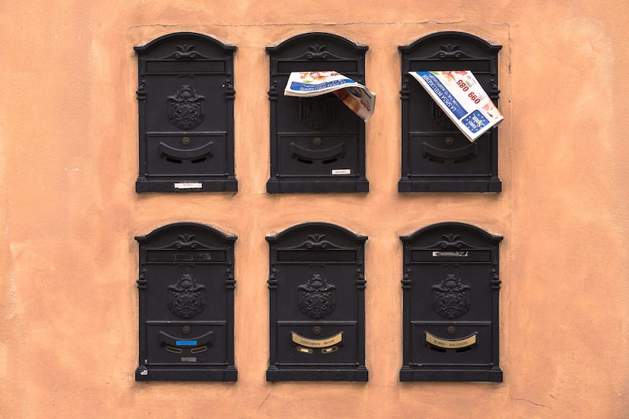
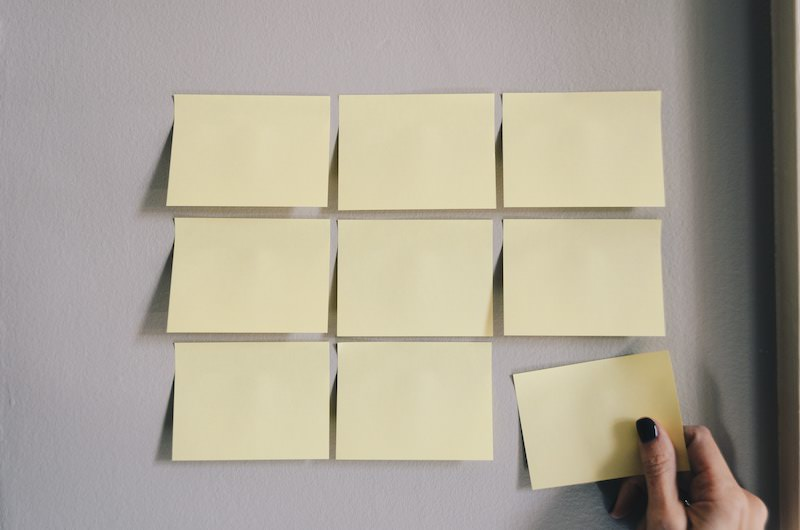

*[In the first part](https://www.codinglawyer.io/posts/learn-reason-react-part-i)*, we initialized our Tic Tac Toe game, tackled some of Reason’s basics and defined our variant types.

We’ll continue where we left off—that is, in the `render` method of the `Board` component. Since we are dealing with lists there, we’ll talk about them a little bit more now, before inspecting the rest of the `render` method.

## Excursion I: list and array

In Reason, we have two data structures resembling JavaScript arrays — `list` and `array`. The `list` is immutable and resizable, whereas the `array` is mutable and has a fixed length. We are using a `list` due to its flexibility and efficiency which really shines when we use it recursively.

To map a `list`, you can use `List.map` method that receives two arguments—a function and a `list`. The function takes an element from the `list` and maps it. This works pretty much like the JavaScript `Array.map`. Here’s a simple example:

```js
let numbers = [1, 5, 8, 9, 15];
let increasedNumbers = List.map((num) => num + 2, numbers);
Js.log(increasedNumbers);  /* [3,[7,[10,[11,[17,0]]]]] */
```

What? You’re saying that the printed result looks weird? This is because the lists in Reason are *[linked](https://en.wikipedia.org/wiki/Linked_list)*.

Printing lists in your code can be confusing. Fortunately, you can convert it into an `array` using the `Array.of_list` method.

```js
Js.log(Array.of_list(increasedNumbers));  /* [3,7,10,11,17] */
```

Let’s come back to our app and remind ourselves how our `state` looks.

```js
let initialState = {
  board: [
    [Empty, Empty, Empty],
    [Empty, Empty, Empty],
    [Empty, Empty, Empty],
  ],
  gameState: Playing(Cross),
};
```

Inside the Board’s `render` method we first map over `board` which is composed of a list of rows. So, by mapping over it, we’ll gain access to the `row`s. Then, we render the `BoardRow` component.

```js
let component = ReasonReact.statelessComponent("Board");

let make = (~state: state, ~onMark, ~onRestart, _children) => {
    ...component,
    render: _ =>
      <div className="game-board">
          ( 
            ReasonReact.array(
                Array.of_list(
                  List.mapi(
                    (index: int, row: row) =>
                      <BoardRow
                        key=(string_of_int(index))
                        gameState=state.gameState
                        row
                        onMark
                        index
                      />,
                    state.board,
                  ),
              ),
            )
        )
      /* ... */
```

We are using the `List.mapi` method, which provides us with an `index` argument that we need to uniquely define our ids.

When mapping the `list` to the JSX elements, we need to do two additional things.

First, we need to convert it to an `array` using `Array.of_list`. Secondly, we need to convert the result to the `reactElement` using `ReasonReact.array`, since we (as already mentioned) can’t simply pass the string to the JSX element like in React.

To get to the field values, we need to map over each `row` as well. We are doing this inside the `BoardRow` component. Here, each element from the `row` is then mapped to the `Square` component.

```js
let component = ReasonReact.statelessComponent("BoardRow");

let make = (~gameState: gameState, ~row: row, ~onMark, ~index: int, _children) => {
    ...component,
    render: (_) =>
      <div className="board-row">
          (ReasonReact.array(
            Array.of_list(
                List.mapi(
                  (ind: int, value: field) => {
                    let id = string_of_int(index) ++ string_of_int(ind);
                    <Square
                        key=id
                        value
                        onMark=(() => onMark(id))
                        gameState
                    />;
                  },
                row,
              ),
          ),
        ))
    </div>,
};
```

Using these two mappings, our board gets rendered. You’ll agree with me that the readability of this code isn’t so good because of all the function wrappings.

To improve it, we can use the `pipe` operator which takes our `list` data and pipes it through our functions. Here’s the second mapping example — this time using `pipe`.

```js
let component = ReasonReact.statelessComponent("BoardRow");

let make = (~gameState: gameState, ~row: row, ~onMark, ~index: int, _children) => {
    ...component,
    render: (_) =>
      <div className="board-row">
          (
            row
            |> List.mapi((ind: int, value: field) => {
                let id = string_of_int(index) ++ string_of_int(ind
                <Square 
                  key=id
                  value
                  onMark=(() => onMark(id))
                  gameState
                />;
              })
            |> Array.of_list
            |> ReasonReact.array
          )
      </div>,
};
```

This makes our code much more readable, don’t you think? First, we take the `row` and pass it to the mapping method. Then, we convert our result to an `array`. Finally, we convert it to the `reactElement`.

By mapping our board, we are rendering a bunch of `Square` components to the screen and by doing so, we are creating the whole playing board.

We’re passing a couple of props to the `Square`. Since we want our `id` to be unique, we create it by combining indices from both mappings. We are also passing down the `value` which contains the `field` type that can be either `Empty` or `Marked`.

Finally, we pass a `gameState` and the `onMark` handler which will get invoked when a particular `Square` is clicked.

## Entering fields



```js
let component = ReasonReact.statelessComponent("Square");

let make = (~value: field, ~gameState: gameState, ~onMark, _children) => {
  ...component,
  render: _self =>
    <button
      className=(getClass(gameState, value))
      disabled=(gameState |> isFinished |> Js.Boolean.to_js_boolean)
      onClick=(_evt => onMark())>
      (value |> toValue |> toString)
    </button>,
};
```

`Square` component renders a button and passes it some props. We are using a couple of helper functions here, but I won’t talk about all of them in detail. You can find them all in the *[repo](https://github.com/codinglawyer/reason-tic-tac-toe)*.

The button’s class is calculated using the `getClass` helper function which turns the square green when one of the players wins. When this happens, all the `Square`s will be disabled as well.

To render the button’s `value`, we use two helpers.

```js
let toValue = (field: field) =>
  switch (field) {
  | Marked(Cross) => "X"
  | Marked(Circle) => "O"
  | Empty => ""
};
```

`toValue` will convert the `field` type to the string using pattern matching. We’ll talk about pattern matching later. For now, you need to know that we are matching the `field` data to our three patterns. So, the result would be `X`, `O`, or an empty string. Then, we use `toString` to convert it to the `reactElement`.

Phew. We’ve just rendered the game board. Let’s quickly recap how we did it.

Our top-level `App` component renders the `Game` component which holds the game state and passes it down along with the handlers to the `Board` component.

The `Board` then takes the board state prop and maps the rows to the `BoardRow` component which maps the rows to the `Square` components. Each `Square` has an onClick handler that will fill it with a square or a circle.

**Make it do something already!** Let’s take a look at how our logic controlling the game works.

Since we have a board, we can allow a player to click on any square. When this happens, the `onClick` handler is fired and the `onMark` handler is called.

```js
/* Square component */
<button
  className=(getClass(gameState, value))
  disabled=(gameState |> isFinished |> Js.Boolean.to_js_boolean)
  onClick=(_evt => onMark())>
  (value |> toValue |> toString)
</button>
```

The `onMark` handler got passed from the `BoardRow` component, but it was originally defined in the `Game` component that takes care of the state.

```js
/* Game component */
render: ({state, send}) =>
    <div className="game">
      <Board
        state
        onRestart=(_evt => send(Restart))
        onMark=(id => send(ClickSquare(id)))
      />
    </div>,
```

We can see that the `onMark` prop is a `ClickSquare` reducer, which means we are using it to update the state (as in Redux). The `onRestart` handler works similarly.

Notice that we are passing square’s unique `id` to the `onMark` handler inside the `BoardRow` component.

```js
/* BoardRow component */
(
  row
  |> List.mapi((ind: int, value: field) => {
    let id = string_of_int(index) ++ string_of_int(ind
    <Square 
      key=id
      value
      onMark=(() => onMark(id))
      gameState
    />;
    })
  |> Array.of_list
  |> ReasonReact.array
)
```

Before taking a look at our reducers in detail, we need to define actions to which our reducers will respond.

```js
type action =
  | ClickSquare(string)
  | Restart;
```

As with the global variant types, this forces us to think about our logic before we start implementing it. We define two action variants. `ClickSquare` takes one argument that will have a type of a`string`.

Now, let’s take a look at our reducers.

```js
let updateBoard = (board: board, gameState: gameState, id) =>
  board
  |> List.mapi((ind: int, row: row) =>
    row
      |> List.mapi((index: int, value: field) =>
        string_of_int(ind) ++ string_of_int(index) === id ?
          switch (gameState, value) {
          | (_, Marked(_)) => value
          | (Playing(player), Empty) => Marked(player)
          | (_, Empty) => Empty
          } :
          value
      )
  );

reducer: (action: action, state: state) =>
    switch (action) {
    | Restart => ReasonReact.Update(initialState)
    | ClickSquare((id: string)) =>
        let updatedBoard = updateBoard(state.board, state.gameState, id);
        ReasonReact.Update({
          board: updatedBoard,
          gameState:
            checkGameState3x3(updatedBoard, state.board, state.gameState),
        });
    },
```

The `ClickSquare` reducer takes an `id` of the particular `Square`. As we’ve seen, we are passing in the `BoardRow` component. Then, our reducer calculates a new state.

For the `board` state update, we’ll call the `updateBoard` function. It uses the same mapping logic we used in the `Board` and `BoardRow` component. Inside of it, we map over the `state.board` to get the rows and then map over the rows to get the field values.

Since the `id` of each square is a composition of ids from both mappings, we’ll use it to find the field which the player clicked. When we find it, we’ll use the pattern matching to determine what to do with it. Otherwise, we’ll leave the square’s `value` unmodified.

## Excursion II: pattern matching


We use the pattern matching to process our data. We define **patterns** which we’ll match against our **data**. When exercising the pattern matching in Reason, we use a `switch` statement.

```js
switch (state.gameState, value) {
  | (_, Marked(_)) => value
  | (Playing(player), Empty) => Marked(player)
  | (_, Empty) => Empty
}
```

In our case, we are using a *[tuple](https://reasonml.github.io/docs/en/tuple.html)* to represent our **data**. Tuples are data structures that separate data with commas. Our `tuple` contains the `gameState` and the `value` (containing the `field` type).

Then we define multiple **patterns** that we’ll match against our data. The first match determines the result of the entire pattern matching.

By writing an underscore inside the pattern, we are telling the compiler that we don’t care what the particular value is. In other words, we want to have a match every time.

For example, the first pattern is matched when the `value` is `Marked` by any player. So, we don’t care about the `gameState` and we don’t care about the player type either.

When this pattern is matched, the result is the original `value`. This pattern prevents players from overriding already marked `Squares`.

The second pattern addresses the situation when any player is playing, and the field is `Empty`. Here, we use the `player` type in the pattern and then again in the result. We are basically saying that we don’t care about which player is playing (`Circle` or `Cross`) but we still want to mark the square according to the player that is actually playing.

The last pattern acts as the default one. If the first or the second pattern isn’t matched, the third will always match. Here, we don’t care about the `gameState`.

However, since we’re checking for the `Playing` game state in the previous pattern, we are now checking for the `Draw` or `Winner` `gameState` type. If this is the case, we’ll leave the field `Empty`. This default scenario prevents players from continuing to play when the game is over.

A cool thing about pattern matching in Reason is that the compiler will warn you if you haven’t covered all the possible pattern matches. This will save you a lot of trouble, because you’ll always know if you’ve covered all the possible scenarios. So, if the compiler is not giving you any warnings, your pattern matching will never fail.

When the pattern matching is finished, the particular field gets updated. When all the mappings are done, we get a new board state and store it as the `updatedBoard`. We can then update the component’s state by calling `ReasonReact.Update`.

```js
ReasonReact.Update({
  board: updatedBoard,
  gameState:
    checkGameState3x3(updatedBoard, state.board, state.gameState),
```

We update the `board` state using the result of the pattern matching. When updating the `gameState`, we call the `checkGameState3x3` helper which calculates the state of the game for us.

## Do we have a winner?

Let’s take a look what the `checkGameState3x3` does.

First, we need to define all the possible combinations of winning fields (for the 3x3 board) and store them as `winningCombs`. We also have to define the `winningRows` type.

```js
type winningRows = list(list(int));

let winningCombs = [
  [0, 1, 2],
  [3, 4, 5],
  [6, 7, 8],
  [0, 3, 6],  
  [1, 4, 7],
  [2, 5, 8],
  [0, 4, 8],
  [2, 4, 6],
];
```

We passed this list to the `checkGameState` function as the first argument.

```js
let checkGameState3x3 = checkGameState(winningCombs);
```

By doing this, we are taking advantage of the *[currying](https://en.wikipedia.org/wiki/Currying)* principle. When we pass the `winningCombs` to the `checkGameState` function, we get back a new function waiting for the rest of the arguments to be passed. We store this new function as the `checkGameState3x3`.

This behavior is really helpful, since we are able to configure the `checkGameState` function depending on the width and height of the board.

Let’s see what’s going on inside the `checkGameState` function.

```js
let checkGameState =
  (
    winningRows: winningRows,
    updatedBoard: board,
    oldBoard: board,
    gameState: gameState,
  ) =>
  oldBoard == updatedBoard ?
    gameState :
    {
      let flattenBoard = List.flatten(updatedBoard);
      let rec check = (rest: winningRows) => {
        let head = List.hd(rest);
        let tail = List.tl(rest);
        switch (
          getWinner(flattenBoard, head),
          gameEnded(flattenBoard),
          tail,
        ) {
        | (Cross, _, _) => Winner(Cross)
        | (Circle, _, _) => Winner(Circle)
        | (_, true, []) => Draw
        | (_, false, []) => whosPlaying(gameState)
        | _ => check(tail)
        };
    };
    check(winningRows);
};
```

First, we check if the board state is different from the previous one. If that’s not the case, we’ll return the unchanged `gameState`. Otherwise, we’ll calculate the new game state.

## Calculating new states


We start determining our new game state by converting the `board` part of the state, which consists of a list of rows, to a simple `list` using `List.flatten`. The flattened result will have this kind of structure:

```js
[Empty, Empty, Empty, Empty, Empty, Empty, Empty, Empty, Empty]
```

Back in the function, we define a `check` function that receives a single `rest` argument that has type of `winningRows` . The `rec` keyword before its definition means that it can be invoked recursively. However, for the recursive function calls, we need recursive data as well. Fortunately, the `list` is a recursive data structure.

We’ve already learned that lists in Reason are linked. This feature enables us to iterate through *[lists using recursion](http://reasonmlhub.com/exploring-reasonml/ch_recursion.html)* easily.

At the bottom of the `checkGameState`, we call the `check` function for the first time and pass it the `winningCombs` list. Inside the function, we extract the first element from the `list` and store it as the `head`. The rest of the `list` gets stored as the `tail`.

After that, we use the pattern matching again. We already know how it works, so I won’t go into detail. But it’s worth checking how we define our data and patterns.

```js
type winner =
  | Cross
  | Circle
  | NoOne;

switch (
  getWinner(flattenBoard, head),
  gameEnded(flattenBoard),
  tail,
) { ...
```

Inside the `switch` statement, we use a `tuple` again to represent our data. Our `tuple` contains three elements—winner type as a result of the `getWinner` function, boolean as a result of the `gameEnded` function, and remaining `list` elements (`tail`).

Before going any further, let’s talk a bit about these two helper functions.

We’ll take a look inside the `getWinner` function first.

```js
let getWinner = (flattenBoard, coords) =>
  switch (
    List.nth(flattenBoard, List.nth(coords, 0)),
    List.nth(flattenBoard, List.nth(coords, 1)),
    List.nth(flattenBoard, List.nth(coords, 2)),
  ) {
  | (Marked(Cross), Marked(Cross), Marked(Cross)) => Cross
  | (Marked(Circle), Marked(Circle), Marked(Circle)) => Circle
  | (_, _, _) => NoOne
  };
```

When we call the `check` recursive function for the first time, the `head` will be the first element of the `winningRows`, that is `[0, 1, 2]` which is a `list`. We pass `head` to the `getWinner` function as the `coords` argument along with the `flattenBoard`.

Again, we use the pattern matching with the `tuple`. Inside the `tuple`, we use the `List.nth` method to access the equivalent positions of the `coords` coordinates in the flattened board `list`. The `List.nth` function takes a `list` and a number and returns the list’s element to that position.

So, our `tuple` consists of the three winning coordinates of our board that we’ve accessed using `List.nth`.

Now, we can match our `tuple` data against the patterns. The first two patterns check if all three fields are marked by the same player. If they are, we’ll return the winner — `Cross` or `Circle`. Otherwise, we’ll return `NoOne`.

Let’s see what’s going on inside the `gameEnded` function. It checks if all the fields are `Marked` and returns a boolean.

```js
let gameEnded = board =>
  List.for_all(
    field => field == Marked(Circle) || field == Marked(Cross),
    board,
  );
```

Since we know what values can be returned from our helper functions, let’s come back to our `check` function.

```js
switch (
  getWinner(flattenBoard, head),
  gameEnded(flattenBoard),
  tail,
  ) {
  | (Cross, _, _) => Winner(Cross)
  | (Circle, _, _) => Winner(Circle)
  | (_, true, []) => Draw
  | (_, false, []) => whosPlaying(gameState)
  | _ => check(tail)
  };
```

Our pattern matching can now determine if the game ended in a win or draw. If these cases are not matched, we’ll move to the following case. If it’s matched, the game will continue and the `whosPlaying` function will be called, and the other player will take a turn.

```js
let whosPlaying = (gameState: gameState) =>
  switch (gameState) {
  | Playing(Cross) => Playing(Circle)
  | _ => Playing(Cross)
  };
```

Otherwise, we’ll call the `check` function recursively with a new combination of winning fields.

That’s it. Now you know how our code controlling the game logic works.

**That’s all folks!** I hope this post series helped you to understand the core features of this promising and still-developing language. However, to fully appreciate the power of this new syntax on top of OCaml, you need to start building your own stuff. Now you’re ready to do that.

Good luck!

***This post was also published on [my Medium blog](https://medium.freecodecamp.org/learn-reasonml-by-building-tic-tac-toe-in-react-334203dd513c) (2018)***


